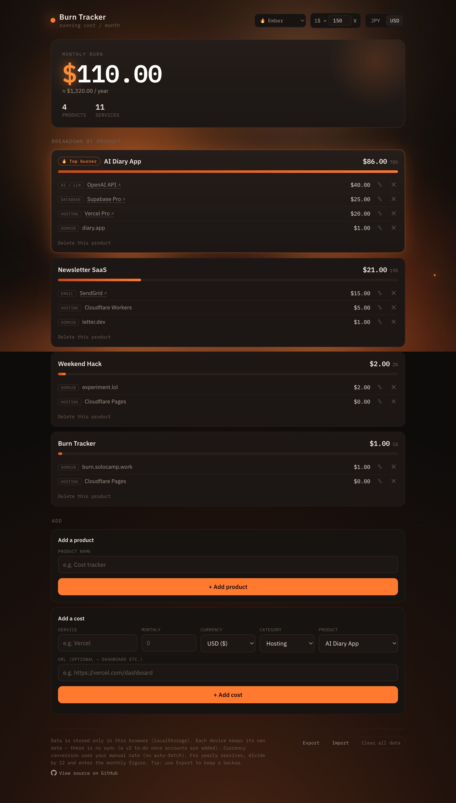
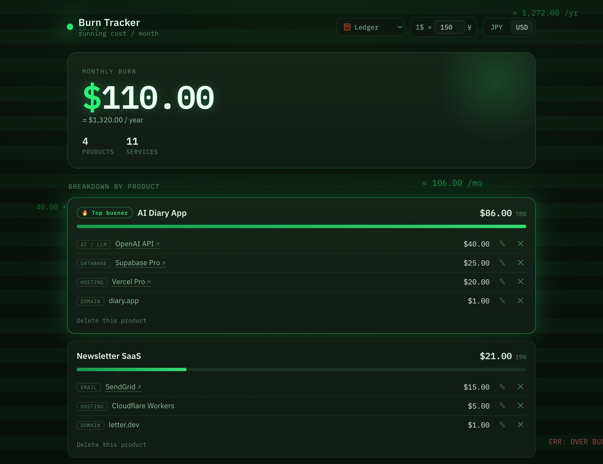
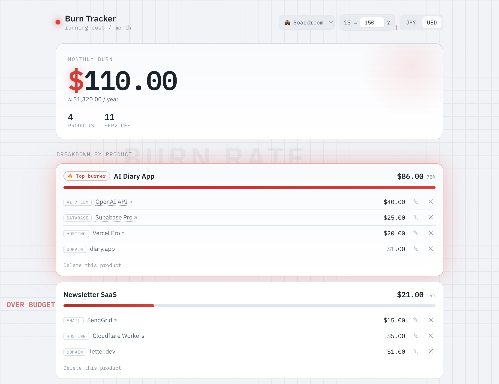
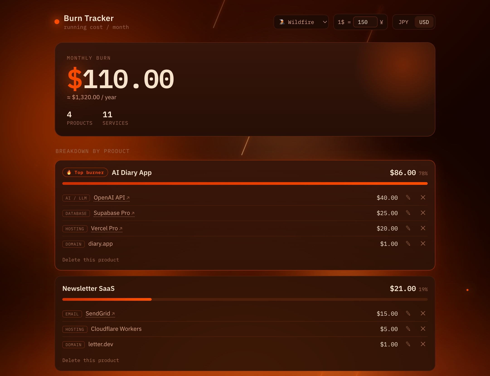
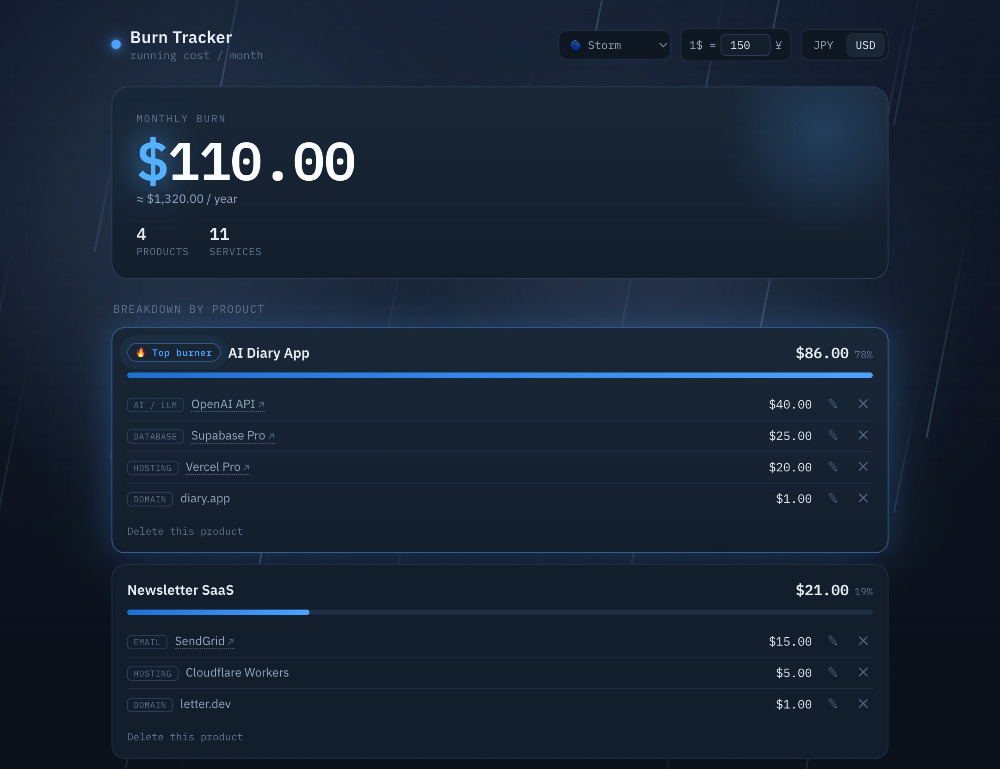
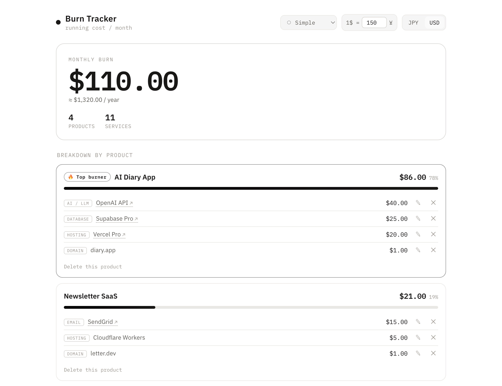

# Burn Tracker

**Track the monthly burn across all your side projects — in one glance.**

A tiny, single-file web app for indie hackers and AI builders who ship a lot of small products and lose track of which one is quietly draining money. Add your products, list the services each one uses, and see your total monthly burn plus a per-product breakdown sorted highest-first — so the biggest money sink is impossible to miss.

No accounts. No tracking. No build step. Just one HTML file.

**Live:** [burn.solocamp.work](https://burn.solocamp.work)



<details><summary>More themes — 🧮 Ledger, 💼 Boardroom, 🌋 Wildfire, 🌀 Storm, ⚪ Simple</summary>

| 🧮 Ledger | 💼 Boardroom |
|---|---|
|  |  |

| 🌋 Wildfire | 🌀 Storm |
|---|---|
|  |  |

| ⚪ Simple | |
|---|---|
|  | |

</details>

---

## Why

If you spin up a new project every week, your running costs scatter across a dozen dashboards — hosting here, a database there, an AI API somewhere else. A spreadsheet technically works, but it won't tell you *"this product has zero users and is still costing you the most every month."* Burn Tracker is built around exactly that insight.

## Features

- **Products & costs** — register products (name only) and attach cost items (service, monthly amount, currency, optional URL).
- **Total monthly burn** — the headline number, with an annual projection.
- **Per-product breakdown** — sorted highest-first, with a heat bar, share of total, and a **"Top burner"** tag on the most expensive product.
- **Mixed currencies** — enter costs in USD or JPY and convert everything with a manual exchange rate. Toggle the display currency anytime.
- **Quick links** — add a service's dashboard URL and click straight through from the breakdown.
- **Six themes** — 🔥 Ember (the default glow), ⚪ Simple (monochrome, zero motion), plus four statement looks: 🌋 Wildfire (the burn, out of control), 🌀 Storm (a hurricane on your budget), 💼 Boardroom (budget-meeting chatter), 🧮 Ledger (green-bar paper and a running calculator tape). Your choice is remembered.
- **Local-first** — all data stays in your browser. Nothing is sent anywhere.

## Run locally

No build, no dependencies. Clone or download the repo and open `index.html`:

```
open index.html      # macOS
# or just double-click the file in any OS
```

## Deploy (free)

It's a static site, so it runs free on any static host. Recommended: **Cloudflare Pages** (free tier, unlimited bandwidth). Two routes:

- **No Git (fastest):** Cloudflare dashboard → *Workers & Pages* → *Create application* → *Pages* → *Use direct upload* → drag in a folder containing `index.html` → *Deploy*. You'll get a `*.pages.dev` URL.
- **With Git:** push to GitHub, then *Create application* → *Pages* → *Import an existing Git repository*. Framework preset: **None**, build command: empty, output directory: `/` (repo root). Every push redeploys automatically.

A custom domain (e.g. a subdomain of your own domain) can be attached later from the project settings — no rebuild needed.

## Data & privacy

- Stored in your browser via `localStorage` under the key `burn-tracker-v1`.
- **Per-device:** data does not sync between your PC and phone, or between different browsers. Clearing site data erases it.
- If `localStorage` is unavailable (e.g. a sandboxed preview), the app keeps working in memory for the session.

## Tech notes

- One HTML file: inline CSS + vanilla JS, no framework, no build.
- Data model: two collections — `products` and `costs` — linked by `id`. Totals are never stored; they're recomputed on every render.
- Fonts: IBM Plex Sans / IBM Plex Mono (loaded from Google Fonts).

## Roadmap (ideas)

- Optional accounts + cloud sync (the main thing `localStorage` can't do).
- Pull real usage/spend from providers (e.g. Vercel, Supabase, AI APIs) instead of manual entry.
- Cost-spike alerts and month-over-month history.
- Cost splitting (one service shared across multiple products).

## License

MIT — do whatever you like.
